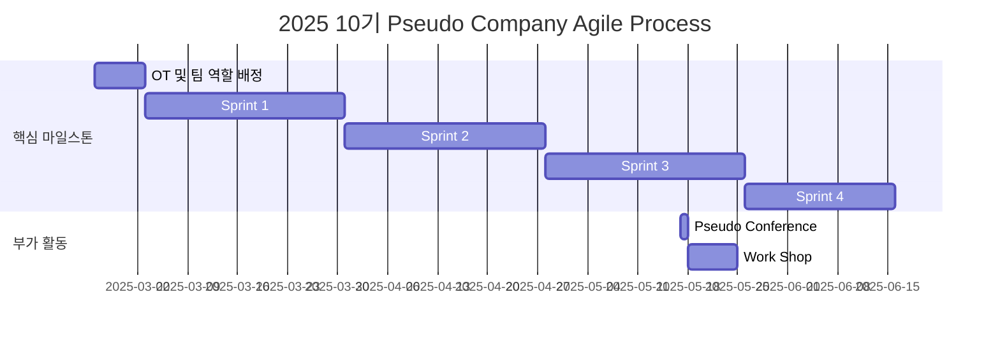

# Pseudo-Company

<h1 align="center" style="color:orange;" > ${\textsf{\color{orange}Pseudo Company(가짜 회사)}}$ </h1>

 

 
 

> 가짜 회사에 오신 여러분들을 환영합니다! 가짜 회사는 Web, Cloud, LLM, sLLM, RAG, Prompt Engineering 등의 기술들을 직접 사용하고 응용하고 활용하여 ${\textsf{\color{ProcessBlue}Multi-Agent Orchestration System}}$을 구축해 생산성을 향상시키는 프로젝트입니다. 

| `폭발적인 성장`, `의미있는 성과 창출`, `AI시대에서 살아남기`, `진짜 협업하기`. 모두 ${\textsf{\color{YellowOrange}Pseudo Company™}}$에서 함께 할 수 있습니다.

## 프로젝트 개요 (Project Overview)
### 여러분들은 어디까지 AI를 활용하고 계신가요?
- AI로 할 수 있는 일은 앞으로 점차 늘어날 것 입니다.
- AI의 발전은 생활이 더 편해진다는 것과 더불어 많은 직업이 자동화 된다는 이야기이기도 합니다.
- IMF보고서에 따르면 선진국에서 AI기술이 ${\textsf{\color{yellow}60\\%}}$의 직업에 영향을 미칠 것으로 전망하였고
- 맥킨지 글로벌 연구소는 2030년까지 전 세계적으로 ${\textsf{\color{yellow}8억개}}$의 일자리가 AI에 의해 대체될 것으로 전망하였습니다.
- 이러한 AI 사회에서 여러분들은 ${\textsf{\color{magenta}어떻게}}$ 행동하실 건가요? 
- "AI에게 ${\textsf{\color{magenta}이용당하실}}$" 건가요? 아니면 "AI를 ${\textsf{\color{magenta}이용하실}}$" 건가요?

### 여러분들은 얼마나 효율적으로 일을 하고 계신가요?
- 시간은 우리 인생에서 유한한 자원입니다.
- 효율적으로 일을 한다는 것은 시간을 절약할 수 있다는 뜻이 되고, 시간을 절약한다는 것은 그 시간만큼 더 가치있는 일을 할 수 있다는 이야기입니다.
- 앞서 말했듯이 앞으로 더 많은 직업들이 ${\textsf{\color{ProcessBlue}자동화}}$가 될 것이고 우리는 더 ${\textsf{\color{ProcessBlue}가치있는 것}}$에 집중해야 합니다.

### LLM 기술만으론 마법이 일어나지 않습니다. 우리는 발상의 전환이 필요합니다.
> _“RAG(Retrieval-Augmented Generation) 기술 자체는 단순하지만, 실제 구현에는 많은 세부사항이 필요합니다. 검색 품질을 높이기 위해 크롤링, 인덱싱, 랭킹 등 여러 기술 요소들을 세밀하게 조정해야 합니다. 순수한 벡터 임베딩만으로는 충분하지 않으며, 전통적인 IR 기법들과 하이브리드 접근이 필요합니다. Perplexity는 자체 Sonar 모델을 개발하고 지속적으로 개선하고 있습니다. 검색 성능 향상을 위해 latency 관리 등 다양한 최적화 작업을 수행하고 있습니다.”_   – Aravind Srinivas, Perplexity CEO. Lex Fridman 팟캐스트에서

- 우리는 AI기술과 더불어 도메인 지식, 모든 분야의 기술을 응용, 조합, 재해석하여 여러 관점에서 Agent 생성을 시도해보고 검증해나갈 것입니다.

### 가짜 회사에서는 Agent들이 여러분들의 일을 대신 수행해 줄 것 입니다.
- 가짜 회사에서는 AI를 극한까지 활용하여 여러분들의 일을 대신 수행해 주는 Agent들을 개발합니다.
- 각자가 ${\textsf{\color{ProcessBlue}원하는 Agent}}$를 개발하여 가짜 회사에 입사시킬 수 있고 해당 Agent는 자체적으로 자신의 업무를 수행합니다.

## 🌟 프로젝트 목표 (Project Vision)
### ${\textsf{\color{WildStrawberry}No Person}}$, ${\textsf{\color{ProcessBlue}Just Agent}}$

#### 첫번째 목표: ${\textsf{\color{YellowOrange}Professional Agents}}$
- PM, PE, 기획자, 디자이너, 마케터 등 여러분들이 만들고 싶은 모든 Agent를 하나하나 개발해나가며 가짜 회사의 가짜 인력을 증원합니다.
- 회사의 규모는 Agent가 늘어나면 늘어날 수록 커져갈 것 입니다.
- 가짜 회사는 엔터테인먼트 회사가 될 수도 있고, 게임 회사가 될 수도 있고, 디자인 회사가 될 수도 있습니다.

#### 두번째 목표: ${\textsf{\color{YellowOrange}Multi-Agent Orchestration}}$
- 개발한 Agent들이 원활하게 협업을 할 수 있도록 환경을 조성하는 것을 목표로 합니다.
- Agent들끼리 회의를 하고, 이슈를 해결하고, 성과를 창출해낼 것 입니다.

#### 세번째 목표: ${\textsf{\color{YellowOrange}Agent Collaboration Visualization}}$
- 실제로 Agent가 협업하는 모습을 홈페이지/프로그램으로 시각화하여 가시성 및 UX를 높힐 것 입니다.

## 🧑 회사 소개

| 역할                | 이름      | 주요 관심 분야  | 소개 링크   |
|---------------------|-----------|-----------------|-------------|
| **Project Manager** | 박중헌    |    |   |
| **Member**          | Your Name    | Anything |  |
| **Member**          | Your Name    | Anything |  |
| **Member**          | Your Name    | Anything |  |
| **Member**          | Your Name    | Anything |  |
| **Member**          | Your Name    | Anything |  |
...

## 🚀 가짜 회사 로드맵 (Pseudo Company Roadmap)

## 🚀 스프린트 진행 방식 (Sprint Process)
세부 프로세스는 러너(팀원)분들과 협의에 의해 변경될 수 있습니다.
| 프로세스명          | 세부 내용                                          |
| ------------------- | -------------------------------------------------- |
| 1. 스프린트 플래닝  | 스프린트 목표 설정                                 |
|                     | Backlog 산정 및 우선순위 배정                      |
|                     | Task 분배 및 추정 기간 설정                        |
| 2. 스프린트 진행    | 데일리 스탠드업                                    |
|                     | 주간 Collab Day                                    |
| 3. 스프린트 마무리  | 스프린트 리뷰                                      |
|                     | 스프린트 회고                                      |

## 💻 주요 활동 (Activity Main History)
| 날짜       | 내용                | 진행 그룹 | 
| ---------- | ------------------- | --------- |
| 2025/02/24 | OT                  | 전체      |
| 2025/05/17 | Pseudo Conference   | 전체      | 
| 2025/05/?? | Work Shop(희망사항) | 전체      | 

## 🛠️ 기술 스택 (Technology Stack)
| 기술                    | 스택      | 
| ----------------------- | --------- |
| Language                |           |
| AI Framework & Library  | ?         | 
| Web Framework & Library | ?         | 
| Database                | ?         | 
| MLOps                   | ?         | 
| DevOps                  | ?         | 
| Collaboration Tools |     | 

## 📈 성과 지표 (Achievement Metrics)
### We Can Make Everything

## 💡 학습 자원 (Learning Resources)
- [중헌 아카이브](https://www.hon2yt2ch.life/): 680+개의 기술 포스트 아카이빙

## 🌱 참여 안내 (How to Engage)
### 팀원으로 참여하시려면 러너 모집 기간에 신청해주세요.
- 링크 (준비중)

### 누구나 스프린트 회의에 참여하실 수 있습니다.
1. 특별한 신청 없이 정기 모임 시간에 맞추어 디스코드 #Room-?? 채널로 입장
2. Magical Week 중 행사에 참가
3. Pseudo Lab 행사에서 만나기

## Acknowledgement 🙏

Pseudo Company is developed as part of Pseudo-Lab's Open Research Initiative. Special thanks to our contributors and the open source community for their valuable insights and contributions.

## About Pseudo Lab 👋🏼</h2>

[Pseudo-Lab](https://pseudo-lab.com/) is a non-profit organization focused on advancing machine learning and AI technologies. Our core values of Sharing, Motivation, and Collaborative Joy drive us to create impactful open-source projects. With over 5k+ researchers, we are committed to advancing machine learning and AI technologies.

<h2>Contributors 😃</h2>

  

<h2>License 🗞</h2>

This project is licensed under the [MIT License](https://opensource.org/licenses/MIT).
