# Pseudo-Company

<h1 align="center" style="color:orange;" > ${\textsf{\color{orange}Pseudo Company(가짜 회사)}}$ </h1>

 

 

> 가짜 회사에 오신 여러분들을 환영합니다! 가짜 회사는 Web, Cloud, AI Backend, LLM, sLLM, RAG, Prompt Engineering 등의 기술들을 직접 사용하고 응용하고 활용하여 여러분들이 ${\textsf{\color{ProcessBlue}원하는 Agent}}$를 만들고, ${\textsf{\color{ProcessBlue}Multi-Agent Orchestration System}}$을 구축하여 생산성을 향상시키는 프로젝트입니다. 

| `폭발적인 성장`, `의미있는 성과 창출`, `AI시대에서 살아남기`, `진짜 협업하기`. 모두 ${\textsf{\color{YellowOrange}Pseudo Company™}}$에서 함께 할 수 있습니다.

## 🌟 프로젝트 개요 (Project Overview)
### 이용 당하느냐. VS 이용 하느냐.
- AI로 할 수 있는 일은 앞으로 점차 늘어날 것 입니다.
- AI의 발전은 생활이 더 편해진다는 것과 더불어 많은 일들이 대체(자동화) 된다는 이야기이기도 합니다.
- IMF보고서에 따르면 선진국에서 AI기술이 ${\textsf{\color{goldenrod}60\\%}}$의 직업에 영향을 미칠 것으로 전망하였고
- 맥킨지 글로벌 연구소는 2030년까지 전 세계적으로 ${\textsf{\color{goldenrod}8억개}}$의 일자리가 AI에 의해 대체될 것으로 전망하였습니다.
- 이러한 AI 사회에서 여러분들은 ${\textsf{\color{magenta}어떻게}}$ 행동하실 건가요? 
- "AI에게 ${\textsf{\color{magenta}이용당하실}}$" 건가요? 아니면 "AI를 ${\textsf{\color{magenta}이용하실}}$" 건가요?

### 왜 우리는 효율적으로 살아가야 하는가? 왜 AI를 활용해야 하는가?
- 시간은 우리 인생에서 가장 소중하고 한정된 자원입니다.
- 효율적으로 살아간다는 것은 이 한정된 시간을 최대한 활용하여, 더 의미 있고 가치 있는 일에 집중할 수 있도록 만드는 것을 의미합니다.
- AI는 반복적이고 단순한 업무를 ${\textsf{\color{ProcessBlue}자동화}}$하여, 같은 작업을 훨씬 빠르고 정확하게 수행할 수 있게 도와줍니다.
- 이를 통해 우리는 남는 시간을 ${\textsf{\color{ProcessBlue}창의적이고 전략적인 업무}}$에 투자할 수 있으며, 개인과 조직 모두 생산성을 극대화할 수 있습니다.
- 가짜 회사는 AI를 활용하여 모든 일에서 인간이 투자하는 시간을 ${\textsf{\color{goldenrod}0}}$으로 수렴해 나갈 것입니다.

### LLM 기술만으론 마법이 일어나지 않습니다. 우리는 발상의 전환이 필요합니다.
> _“RAG(Retrieval-Augmented Generation) 기술 자체는 단순하지만, 실제 구현에는 많은 세부사항이 필요합니다. 검색 품질을 높이기 위해 크롤링, 인덱싱, 랭킹 등 여러 기술 요소들을 세밀하게 조정해야 합니다. 순수한 벡터 임베딩만으로는 충분하지 않으며, 전통적인 IR 기법들과 하이브리드 접근이 필요합니다. Perplexity는 자체 Sonar 모델을 개발하고 지속적으로 개선하고 있습니다. 검색 성능 향상을 위해 latency 관리 등 다양한 최적화 작업을 수행하고 있습니다.”_   – Aravind Srinivas, Perplexity CEO. Lex Fridman 팟캐스트에서

- 우리는 AI 기술과 더불어 개인이 가지고 있는 도메인 지식/기술 등을 ${\textsf{\color{ProcessBlue}응용, 조합, 재해석}}$하여 여러 관점에서 Agent 생성을 시도해보고 검증해나갈 것입니다.

### 가짜 회사에서는 Agent들이 여러분들의 일을 대신 수행해 줄 것 입니다.
- 가짜 회사에서는 AI를 극한까지 활용하여 여러분들의 일을 대신 수행해 주는 Agent들을 개발합니다.
- 각자가 ${\textsf{\color{ProcessBlue}원하는 Agent}}$를 개발하여 가짜 회사에 입사시킬 수 있고 해당 Agent는 자체적으로 자신의 업무를 수행합니다.

## 🎯 프로젝트 목표 (Project Vision)
### ${\textsf{\color{WildStrawberry}No Human}}$, ${\textsf{\color{ProcessBlue}Just Agent}}$

#### 첫번째 목표: ${\textsf{\color{YellowOrange}Professional Agents}}$
- ${\textsf{\color{ProcessBlue}CEO, CTO, 개발자, 기획자, 디자이너, 마케터, 테스터, 웹툰 작가, 화가, 아이돌 등}}$ 여러분들이 만들고 싶은 모든 Agent를 하나하나 개발해나가며 가짜 회사의 가짜 인력을 증원합니다.
- Agent가 늘어나면 늘어날 수록 회사의 규모는 커져갈 것 입니다.
- 가짜 회사는 엔터테인먼트 회사가 될 수도 있고, 게임 회사가 될 수도 있고, 디자인 회사가 될 수도 있습니다.

#### 두번째 목표: ${\textsf{\color{YellowOrange}Multi-Agent Orchestration}}$
- 개발한 Agent들이 원활하게 ${\textsf{\color{ProcessBlue}협업}}$을 할 수 있도록 환경을 조성하는 것을 목표로 합니다.
- 가짜 회사의 Agent들은 ${\textsf{\color{ProcessBlue}스스로}}$ 회의를 하고, 이슈를 해결하고, 성과를 창출해낼 것 입니다.

#### 세번째 목표: ${\textsf{\color{YellowOrange}Agent Collaboration Visualization}}$
- 실제로 Agent가 협업하는 모습을 홈페이지/프로그램으로 시각화하여 ${\textsf{\color{ProcessBlue}가시성 및 UX}}$를 높힐 것 입니다.

## 🧑 회사 구성원 소개

| 역할                | 이름      | 주요 관심 분야  | 소개 링크   |
|---------------------|-----------|-----------------|-------------|
| **Project Manager** | 박중헌    |    |   |
| **Member**          | Your Name    | Anything |  |
| **Member**          | Your Name    | Anything |  |
| **Member**          | Your Name    | Anything |  |
| **Member**          | Your Name    | Anything |  |
| **Member**          | Your Name    | Anything |  |
...

## 🚀 가짜 회사 로드맵 (Pseudo Company Roadmap)

```mermaid
gantt
    title 2025 10기 Pseudo Company Agile Process
    section 핵심 마일스톤 
    OT 및 팀 역할 배정        :a1, 2025-03-03, 7d
    Sprint 1                  :a2, after a1, 28d
    Sprint 2                  :a3, after a2, 28d
    Sprint 3                  :a4, after a3, 28d
    Sprint 4                  :a5, after a4, 14d
    section 부가 활동
    Pseudo Magical Week       :b1, 2025-03-23, 7d
    Pseudo Magical Week       :b2, 2025-04-27, 7d
    Pseudo Conference         :b3, 2025-05-17, 1d
    Work Shop                 :b4, after b3, 2d
```

## 🏃 스프린트 진행 방식 (Sprint Process)
세부 프로세스는 러너(팀원)분들과 협의에 의해 변경될 수 있습니다.
| 프로세스명          | 세부 내용                                       | 진행 그룹 |
| ------------------- | ----------------------------------------------- | ------------ |
| 1. 스프린트 플래닝  | 스프린트 목표 설정                                 |   팀            | 
|                     | Backlog 산정 및 우선순위 배정                      |   팀            |
|                     | Task 분배 및 추정 기간 설정                        |    팀           |
| 2. 스프린트 진행    | 데일리 스탠드업                                    |    팀           |
|                     | 격주 토요일 Collab Day                             |  희망인원        |
| 3. 스프린트 마무리  | 스프린트 리뷰                                      |  팀            |
|                     | 스프린트 회고                                      |    전체         |

## 📅 주요 활동 (Activity Main History)
일부 활동은 러너(팀원)분들과 협의에 의해 추가될 수 있습니다.
| 날짜                | 내용                   | 진행 그룹 | 
| ------------------- | ---------------------- | --------- |
| 2025/03/03          | OT                     | 전체      |
| 2025/03/23-03/29    | Magical Week           | 개인      | 
| 2025/04/07          | Sprint1 Retrospective  | 전체      | 
| 2025/04/27-05/03    | Magical Week           | 개인      | 
| 2025/05/05          | Sprint2 Retrospective  | 전체      | 
| 2025/05/17          | Pseudo Conference      | 전체      | 
| 2025/05/??-??       | Work Shop(희망사항)     | 전체      |
| 2025/06/02          | Sprint3 Retrospective  | 전체      |
| 2025/06/16          | Sprint4 Retrospective  | 전체      |

## 🛠️ 기술 스택 (Technology Stack)
| 기술                    | 스택      | 
| ----------------------- | --------- |
| Language                |  ... |
| AI Framework & Library  |    ... | 
| Web Framework & Library | ?         | 
| Database                | ?         | 
| MLOps                   |  ... | 
| DevOps                  | ?         | 
| Collaboration Tools |     | 

## 🌱 참여 안내 (How to Engage)
### 정규 팀원(러너)으로 참여하시려면 러너 모집 기간에 신청해주세요.
- 정규 모집 기간: 2025.02.19~03.01
- 링크 : 준비중
- 1차 모집 인원 : 00명

### 최소 요건
- 스프린트 이탈 사유가 없으신 분
- 본인이 맡은 Task를 책임감있게 소화하실 수 있으신 분
- 연락이 잘 되시는 분

### 최소 역량
- 참여하시는 분야(웹, AI 등등)에서의 기본 프로그래밍 능력
- 상호 존중과 열린 자세에 기반한 커뮤니케이션 및 협업 능력

### 저희는 지원자님에게 이런 걸 알고 싶어요!
- 해당 프로젝트에서 어떤 Task를 주로 맡고 싶으신가요? Agent(AI Backend, RAG, LLM...), Web, Design 등 - 팀 구성에 활용됩니다.
- 만들고 싶은(or 원하는) Agent가 있나요?
- 특별히 사용해보고 싶은 기술 스택(Framework, Library, Opensource 등)이 있나요?
- 프로젝트에서 바라는 점이 있다면?

### 포텐 넘치는 시너지 (Synergy)
🔍 궁금한 건 못 참으시는 분

🧗 도전하는 것을 주저하지 않으시는 분

😤 수동적이지 않고 능동적인 분

🧱 "벽은 부수라고 있는 거야"라고 생각하시는 분

❤️‍🔥 열정이 너무 뜨거워 컵라면 정도는 열정으로 끓이시는 분

## 🏅 성과 지표 (Achievement Metrics)
| 부문                    | 수치      | 
| ----------------------- | --------- |
| 개발된 Agent 수         | 0         | 

## 💡 참고 레퍼런스 (Reference)
- [Tips for building AI Agents](https://www.youtube.com/watch?v=LP5OCa20Zpg): Agent의 전망, 팁
- [AI Agents Course](https://huggingface.co/learn/agents-course/unit0/introduction): HuggingFace AI Agent Course
- [ADAS, Automated Design of Agentic Systems](https://arxiv.org/pdf/2408.08435): 다른 AI를 설계하는 Meta Agent
- [ChatDev: Communicative Agents for Software Development](https://arxiv.org/pdf/2307.07924): Agent들로 구성된 게임회사

### 최종 산출물 예시: ChatDev

## Acknowledgement 🙏
Pseudo Company is developed as part of Pseudo-Lab's Open Research Initiative. Special thanks to our contributors and the open source community for their valuable insights and contributions.

## About Pseudo Lab 👋🏼</h2>

[Pseudo-Lab](https://pseudo-lab.com/) is a non-profit organization focused on advancing machine learning and AI technologies. Our core values of Sharing, Motivation, and Collaborative Joy drive us to create impactful open-source projects. With over 5k+ researchers, we are committed to advancing machine learning and AI technologies.

## Contributors 😃

  

## License 🗞

This project is licensed under the [MIT License](https://opensource.org/licenses/MIT).
